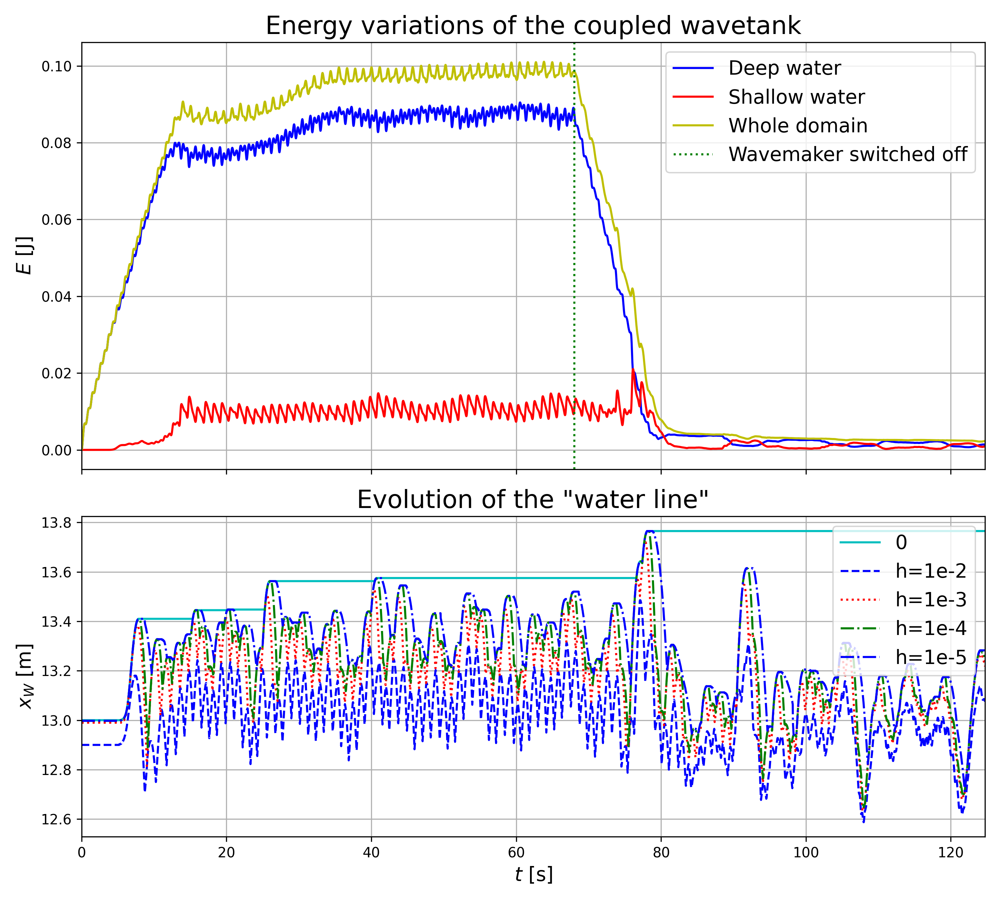

Coupled beach and wave: basic codes and analysis codes

Main code(s) FG&YL: python3 coupled_tank.py (creates data files).
See also theses Floriane Gidel (2018) and Yang Lu (2025) University of Leeds.

Run time OB macbook 2020 via Dockers installation FD: Before time loop: 102.00s Computation time: 2h15min21.46s Total:8121.46s Memory usage less than ~406MB

Run time YL macbook Intel installation FD: ~1:27hr Memory usage less than ~300MB

Analyse energy and waterline (OB: NB. h=0 waterline analysis updated 22-05-2025) run in main directory: python3 pp_energy1244.py 

Python and paraview files to be run (I guess in data directory): dwswbeach2025.pvsm, dwswbeachwave2025.pvsm, dwswbeachwave2025.py (OB: untested)

Paraview instructions in Paraview5.docx file (OB)

Added run-up heights to the code in order to assess where the "water line" resides as it does not reside at the h=0-contour when water is receding. Added new energy-plotting and main files. For comparison of PF and MSA, using h=0 may be okay, but it is not the waterline; percentage change in water line xw is artificial since xw average value is artificial. See 
